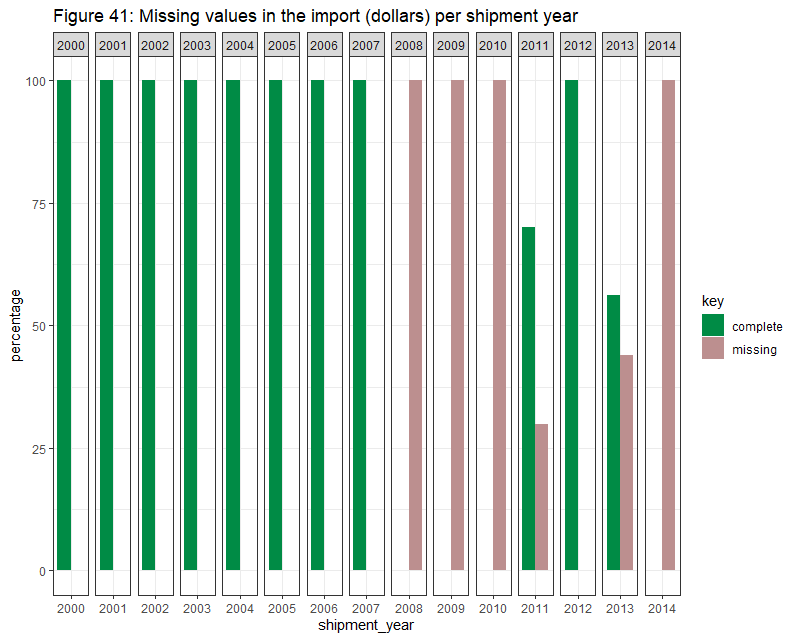

# REPORT 
## BACKGROUND

The aim of this study is to analyze United States wildlife and wildlife product imports. For this purpose, we reviewed 15 years (2000-2014) of data from the Law Enforcement Managment Information System (LEMIS), originally collected by the United States Fish and Wildlife Service (USFWS), cleaned, standardized and stored into a R package called lemis by EcoHealth Alliance. You can find more information about this dataset [Here](https://www.nature.com/articles/s41597-020-0354-5).

## METHOD AND DATA INCLUDED
The data collected by EcoHealth Alliance includes records of plants, microorganisms and animals, among others. For this analysis, we'll exclude those elements belonging to fungi, plantae, bacteria, chromista and unspecified kingdoms, considering only those organisms of the Kingdom Animalia. 

Between January 01, 2000, and December 31, 2014, around **2 million wildlife shipments were imported into the United States**, involving around 11,5 billions of wildlife items plus 1,1 billion kg of wildlife items only measured in weight.  

A **shipment** refers to any container or group of containers that share a common control number, country of shipment and shipment date. Each shipment may be represented in the lemis dataset by multiple **segments** or rows, because the contents are derived from more than one species or type of product. 

The dataset includes taxonomic information (e.g., taxa, genus or species), wildlife description (type/form of the product such as “live specimens” or “jewelry”), quantity, unit (of the quantity metric, e.g. number or kg), value of the product (reported in US dollars), country of origin, country of export, purpose, source, action taken by USFWS on import, disposition of the shipment, disposition date, disposition year, shipment date, shipment year, import_export (whether the shipment was being imported to the EEUU or exported from the EEUU), port of entry, the US importing party, the foreign exporting party and cleaning notes generated during data cleaning. (See Appendix A and Appendix  B for more information about data fields). 

We carried out three types of analyses:

- (1) We carried out an exploratory analysis of the whole dataset, looking for relevant insights about the volume and the content. 

- (2) We analyzed general trends: number of shipments, percentage of refused shipments, money spent and amount of items. 

- (3) We analyzed the amount of money spent based on different categories

## KEY FINDINGS

## EXPLORATORY ANALYSIS
A total of 2,079,637 unique shipments containing 5,451,832 segments were identified between January 01, 2000, and December 31, 2014. 

- Of those, 60% (1,265,491 unique shipments) represented single segments. It means that for 1,265,491 shipments only one species and one type of product were discovered. The remaining 40% (814,146 unique shipments) contained 4,186,341 segments.

- These multiple segments shipments contained from 2 to 492 segments. The average number of segments in this kind of shipments was 5; the median was 3. 

### Description
**It represents the type/form of the wildlife product**. The FWS Import/Export Key recognizes 94 different descriptions for wildlife items, although only 87 of them were used in this dataset. 

**Based on the types of items by segment**, most of them contain "Live specimens" (29%), followed by trophies (17%), "shell products" (9%), small leather products (7%) and jewelry (6%). Together, the top-five descriptions represent 68% of all segments (Figure 1) 

<iframe src="./plotly/description.html" width="100%" height="400" id="igraph" scrolling="no" seamless="seamless" frameBorder="0"> </iframe>

The description "live specimen" is the most common one. It refers to live animals and is mainly made up of corals (38%) and fish (23%). The second most common description is "trophy",which refers to all the parts of one animal, if they are exported together (e.g. horns, skull, cape, backskin, tail and feet constitute one trophy). It's almost entirely made from mammals (89%). "Shell products" (from mollusc or turtle) are almost entirely derived from shells (98%). The description "small leather products" includes belts, handbags, wallets and watch bands. Most of them are derived from reptiles (81%). Finally, the "jewelry" description (other than ivory jewelry) is mainly derived from shells (93%) (Figure 2). 

<iframe src="./plotly/descriptions_taxa.html" width="100%" height="400" id="igraph" scrolling="no" seamless="seamless" frameBorder="0"> </iframe>

**If we take into account the quantity of items in trade (instead of the number of segments): Based on the number of items**, jewelry (other than ivory), shell (mollusc, raw or unworked), feather, hair product (including paint brush) and egg (dead or blown, excluding caviar) are the most common products (Figure 3). And **based on the kg of items**, meat, dead animal (whole animal), frog leg, live specimen and shell are the most common products (Figure 4).

<iframe src="./plotly/description_number.html" width="100%" height="400" id="igraph" scrolling="no" seamless="seamless" frameBorder="0"> </iframe>

<iframe src="./plotly/description_kg.html" width="100%" height="400" id="igraph" scrolling="no" seamless="seamless" frameBorder="0"> </iframe>

### Purpose 
**It represents the declared reason the wildlife product is being imported**. It's declared by the importer. The FWS Import/Export Key recognizes 12 different purposes of import and all of them were used in this dataset. 

**Based on the types of items by segment**, most of them were imported for "Commercial" (75%) and "hunting trophies" (18%) purposes. Together, both purposes represent 92% of all segments (Figure 5).

<iframe src="./plotly/purposes.html" width="100%" height="600" id="igraph" scrolling="no" seamless="seamless" frameBorder="0"> </iframe>

Most of the segments were imported for commercial purposes. Most of their items came from shells (27%), corals (17%) and reptiles (17%).The second most common purpose was "hunting trophies". These imports involved mainly mammals (87%) and birds (13%). Personal imports involved mammals (49%), birds (14%) and reptiles (13%) (Figure 6). 

<iframe src="./plotly/purpose_taxa.html" width="100%" height="600" id="igraph" scrolling="no" seamless="seamless" frameBorder="0"> </iframe>

**If we take into account the quantity of items in trade (instead of the number of segments): Based on the number of items**, "reintroduction/introduction into the wild", "breeding in captivity or artificial propagation" and "scientific" are the most common purposes (Figure 7). And **based on the kg of items**, "commercial" and "hunting trophies"  are the most common purposes (Figure 8). 

<iframe src="./plotly/purpose_number.html" width="100%" height="400" id="igraph" scrolling="no" seamless="seamless" frameBorder="0"> </iframe>

<iframe src="./plotly/purpose_kg.html" width="100%" height="400" id="igraph" scrolling="no" seamless="seamless" frameBorder="0"> </iframe>

### Source
**It represents the type of source within the origin country (e.g., wild, bred)**. The FWS Import/Export Key recognizes 10 different sources for wildlife items, although only 8 of them were used in this dataset. 

**Based on the source of the items by segment**, the most common sources in the segments are "specimens taken from the wild" (78%) and "animals bred in captivity" (15%). Together, both represent around 93% of all segments (Figure 9).

<iframe src="./plotly/sources.html" width="100%" height="600" id="igraph" scrolling="no" seamless="seamless" frameBorder="0"> </iframe>

### Ports, countries and trade routes
**The trade route involves the ports of entry, the country of export and the country of origin.**

#### Country of origin
The country of origin provides information about the real nature of wildlife traffic. **Shipments come from 252 different countries of origin, although 75% of all the segments come from the same 15 countries.** The top-five countries of origin were Indonesia (15%), Canada (10%), South Africa (9%), Philippines (8%) and China (7%). Together, they represent around 50% of all segments (Figure 10). 

<iframe src="./plotly/county_origin.html" width="100%" height="400" id="igraph" scrolling="no" seamless="seamless" frameBorder="0"> </iframe>

Half of the segments originated from Indonesia were derived from corals (54%). More than half of the segments originated from the Philippines (62%) and China (58%) were derived from shells. Most of the segments originated from Canada (72%) and South Africa (82%) were derived from mammals (Figure 11).

<iframe src="./plotly/countryorigin_taxa.html" width="100%" height="400" id="igraph" scrolling="no" seamless="seamless" frameBorder="0"> </iframe>

**If we take into account the quantity of items in trade (instead of the number of segments): Based on the number of items**, Indonesia, Japan, Thailand, Singapore and Hong Kong SAR China are the most common countries of origin (Figure 12). And **based on the kg of items**, China, South Korea, India, Canada and New Zealand are the most common countries of origin (Figure 13). 

<iframe src="./plotly/countryorigin_number.html" width="100%" height="400" id="igraph" scrolling="no" seamless="seamless" frameBorder="0"> </iframe>

<iframe src="./plotly/countryorigin_kg.html" width="100%" height="400" id="igraph" scrolling="no" seamless="seamless" frameBorder="0"> </iframe>

#### Country of export
**Shipments were exported to the UUEE from 257 different countries, although the top 15 represent 75% of all segments.** The top-five countries of export were Canada (12%), Indonesia (12%), South Africa (8%), Philippines (8%) and Italy (7%) (Figure 14)

<iframe src="./plotly/country_exp.html" width="100%" height="400" id="igraph" scrolling="no" seamless="seamless" frameBorder="0"> </iframe>

Following a similar pattern, most of the segments exported from Canada (67%) and South Africa (94%) were derived from mammals. More than a half of the segments exported from Indonesia were derived from corals (69%). More than a half of the segments exported from the Philippines were derived from shells (60%). And finally, more than a half of the segments exported from Indonesia were derived from corals (69%) (Figure 15). 

<iframe src="./plotly/countryexp_taxa.html" width="100%" height="400" id="igraph" scrolling="no" seamless="seamless" frameBorder="0"> </iframe>

**If we take into account the quantity of items in trade (instead of the number of segments): Based on the number of items**, Philippines, China, Thailand, Taiwan and Singapore are the most common countries of export (Figure 16).And **based on the kg of items**, China, South Korea, India, Canada and New Zealand are the most common countries of export (Figure 17). 

<iframe src="./plotly/countryexport_number.html" width="100%" height="400" id="igraph" scrolling="no" seamless="seamless" frameBorder="0"> </iframe>

<iframe src="./plotly/countryexport_kg.html" width="100%" height="400" id="igraph" scrolling="no" seamless="seamless" frameBorder="0"> </iframe>

#### Port of entry
Although [there are around 328 ports of entry into the EEUU](https://www.cbp.gov/), only 73 of them are represented in this dataset. This is because not all of them are covered by FWS wildlife inspectors. By law, [only 18 of them are designated ports with  full-time inspectors](https://www.fws.gov/le/wildlife-inspectors.html).

Based on the number of segments, the top-five ports of entry were Los Angeles (20%), New York(19%), Miami(6%), Newark(5%) and San Francisco(5%). Together, they represent 56% of all segments. The top 15 represent 84% of all segments (Figure 18). It's interesting to point out that the top-five ports of entry are all designated ports. 

<iframe src="./plotly/port_of_entry.html" width="100%" height="400" id="igraph" scrolling="no" seamless="seamless" frameBorder="0"> </iframe>

Almost half of the segments imported into the EEUU through Los Angeles (42%) were derived from corals. Many of the segments imported through Newark (35%) and Miami (28%) are derived from reptiles. Many of the segments imported through New York (36%) and San Francisco (31%) were derived from mammals (Figure 19). 

<iframe src="./plotly/port_taxa.html" width="100%" height="400" id="igraph" scrolling="no" seamless="seamless" frameBorder="0"> </iframe>

**If we take into account the quantity of items in trade (instead of the number of segments): Based on the number of items**, Newark, New York, Chicago, Miami and Boston are the most common ports (Figure 20). And **based on the kg of items**, Los Angeles, Anchorage, Newark, Atlanta and Boston are the most common ports (Figure 21).

<iframe src="./plotly/port_number.html" width="100%" height="400" id="igraph" scrolling="no" seamless="seamless" frameBorder="0"> </iframe>

<iframe src="./plotly/port_kg.html" width="100%" height="400" id="igraph" scrolling="no" seamless="seamless" frameBorder="0"> </iframe>

#### Trade Routes

The top-five most used trade routes (from the country of export to the port of entry in the United States) emerged from this analysis were:
Indonesia to Los Angeles, CA (7%), Italy to New York, NY (4%), South Africa to New York, NY (2%), Hong Kong SAR China to New York, NY (2%) and Philippines to Los Angeles, CA (2%). 

The trade route from Indonesia to Los Angeles, CA was used for segments derived mainly from corals (77%). More than a half of the segments in the trade route from Italy to New York, Ny derived from reptiles (58%). The trade routes from South Africa to New York (91%) and from Hong Kong SAR China to New York, NY (61%) derived from mammals. Finally, the trade route from Philippines to Los Angeles, CA (43%) was mainly used for segments derived from shells (Figure 22).

<iframe src="./plotly/route_taxa.html" width="100%" height="400" id="igraph" scrolling="no" seamless="seamless" frameBorder="0"> </iframe>

### American corporations
We have grouped the major corporations based on the company names, this way we will know which American corporations are importing the most. It represents around 18% of the data, covering around 1.000.000 segments. 

The top-five corporations related to fashion, luxury and design are Prada, Hermès, Richemont, Gucci and DFS Group (Figure 23). The top-five corporations related to animals or animal products providers are Arsian Imports, Dolphin International, Sea Dweling creatures, Underwater World and Walth Smith International (Figure 24). 

<iframe src="./plotly/Animal_animal_prodproviders_corp.html" width="100%" height="600" id="igraph" scrolling="no" seamless="seamless" frameBorder="0"> </iframe>
<iframe src="./plotly/FashionLuxuryDesign_corp.html" width="100%" height="600" id="igraph" scrolling="no" seamless="seamless" frameBorder="0"> </iframe>

### Taxonomic classification
The variables related to the taxa, genus and species provide us information to identify the wildlife or wildlife product. 

#### Taxa level
**The taxa represents the USFWS-derived broad taxonomic categorization**.Using the provided "species_code" field and USFWS keys. It doesn't represent a consistent biological classification scheme but a way of categorizing groups of organisms in the trade. 

In total, 13 different taxa categories were used in this dataset. **Based on the segments**, the top-five taxa levels were mammal (29%), shell (20%), reptile (13%), coral (12%) and fish (8%) (Figure 25). 

<iframe src="./plotly/taxa.html" width="100%" height="600" id="igraph" scrolling="no" seamless="seamless" frameBorder="0"> </iframe>

**If we take into account the quantity of items in trade (instead of the number of segments): Based on the number of items**, birds, mammals, crustaceans, echinoderms and reptiles are the most imported (Figure 26). And **based on the kg of items**, shells and fish are the most imported (Figure 27). 

<iframe src="./plotly/taxa_number.html" width="100%" height="400" id="igraph" scrolling="no" seamless="seamless" frameBorder="0"> </iframe>

<iframe src="./plotly/taxa_kg.html" width="100%" height="400" id="igraph" scrolling="no" seamless="seamless" frameBorder="0"> </iframe>

#### Genus level
**The genus represents the higher-level taxonomic name of the wildlife product.** It corresponds to the taxonomic genus, but sometimes higher-level categorizations were provided when the genus was unknown (for example, "Tropical fish"). 

In total, 2663 different genus categories were used in this dataset. **Based on the segments** the top-five genus levels were Pinctada (6%), Alligator (3%), Ursus (3%), Python (2%) and Mustela (2%) (we didn't take into account the "Tropical Fish" due to it's not a genus-level taxonomic classification) (Figure 28). 

<iframe src="./plotly/genus.html" width="100%" height="400" id="igraph" scrolling="no" seamless="seamless" frameBorder="0"> </iframe>

*Pinctada* was the most common imported genus. It's a genus of saltwater oysters that includes nineteen species, although only nine of them were identified in the dataset. Pinctada maxima and pinctada margaritifera (two of the three major commercial pearl oyster species) made up 84% of pinctada segments (Figure 29). Most of the items from this genus were shell products (57%) or jewelry (37%). 

*Alligator* was the second most common imported genus. It's a crocodilian that has two living species: the American or common alligator (A. mississippiensis) and the Chinese alligator (A. sinensis). Both of them were identified in the dataset, although the common alligator made up more than 99% of the alligator segments (Figure 29). Most of the items from this genus were small leather products (79%) or shoes (9%). 

*Ursus* was the third most common imported genus. It's a genus in the family Ursidae (bears) that includes four widely distributed type of bears: the brown (U. arctos), the polar (U. maritimus), the American black (U. americanus) and the Asian black (U. thibetanus). All of them were identified in the dataset, although the American black bear made up around 94% of ursus segments (Figure 29). Most of the items from this genus were trophies (71%), skins (8%) and skulls (7%). 

*Python* was the fourth most common imported genus. It's a genus of constricting snakes. Between seven and thirteen python species have been recognized (twelve of them were identified in the dataset). Python Reticulatus (popular to keep as pet) and P. Molurus made up around 80% of the python segments (Figure 29). Most of the items from this genus were small leather products (40%) and shoes (28%). 

*Mustela* was the fifth most common imported genus. It includes seventeen species that are small, active predators, with long and slender bodies and short legs (for example: vison, lutreola, nivalis and sibirica). M. vison (usually used in manufacturing coats, jackets and capes) made up around 86% of the mustela segments (Figure 29). Most of the items from this genus were garment (65%) and trims (16%). 

<iframe src="./plotly/genus_species.html" width="100%" height="400" id="igraph" scrolling="no" seamless="seamless" frameBorder="0"> </iframe>

**If we take into account the quantity of items in trade (instead of the number of segments): Based on the number of items**, Pinctada, Tectus and Anadara are the most imported (Figure 30). And **based on the kg of items**, Illex, loligo and octopus are the most imported (Figure 31). 

<iframe src="./plotly/genus_number.html" width="100%" height="400" id="igraph" scrolling="no" seamless="seamless" frameBorder="0"> </iframe>

<iframe src="./plotly/genus_kg.html" width="100%" height="400" id="igraph" scrolling="no" seamless="seamless" frameBorder="0"> </iframe>

#### Species level
**It represents species of the wildlife product**. In total, around 12.000 species were identified in this dataset (to get a more illustrative  name, we combined genus and species). **Based on the segments** the top-five species were Alligator - mississippiensis (3%), Ursus - americanus (2%), Mustela - vison	(2%), Struthio - camelus	(2%) and Pinctada - margaritifera	(2%) (Figure 32). 

<iframe src="./plotly/species.html" width="100%" height="400" id="igraph" scrolling="no" seamless="seamless" frameBorder="0"> </iframe>

*Alligator - mississippiensis* was the most common imported species. Most of them were small leather products and shoes (Figure 33) and were taken from the wild or bred in captivity (Figure 34). 

*Ursus - americanus* was the second most common imported species. Most of them were trophies (Figure 33) and were taken from the wild (Figure 34). 

*Mustela - vison* was the third most common imported species. Most of them were garment and trims (Figure 33) and were specimens originating from a ranching operation or bred in captivity (Figure 34).

*Struthio - camelus* was the fourth most common imported species. Most of them were small leather products, shoes or feathers (Figure 33) and were bred in captivity or taken from the wild (Figure 34). 

*Pinctada - margaritifera* was the fifth most common imported species. Most of them were shell products and jewelry (Figure 33) and were specimens taken from the wild (Figure 34). 

<iframe src="./plotly/species_description.html" width="100%" height="600" id="igraph" scrolling="no" seamless="seamless" frameBorder="0"> </iframe>

<iframe src="./plotly/species_source.html" width="100%" height="600" id="igraph" scrolling="no" seamless="seamless" frameBorder="0"> </iframe>

**If we take into account the quantity of items in trade (instead of the number of segments): Based on the number of items**, Tectus - niloticus, Pinctada - margaritifera, Pinctada - fucata, Pinctada - martensii	 and Anadara - scapha	are the most imported (Figure 35). And **based on the kg of items**, Illex - argentinus is the most imported (Figure 36). 

<iframe src="./plotly/species_number.html" width="100%" height="600" id="igraph" scrolling="no" seamless="seamless" frameBorder="0"> </iframe>

<iframe src="./plotly/species_kg.html" width="100%" height="600" id="igraph" scrolling="no" seamless="seamless" frameBorder="0"> </iframe>

### Refused segments
**98.28% of segments were legally declared, just 1.73% was refused.** We can find cleared and refused segments in the same unique shipment.

Most of the refused shipments included items related with mammals (e.g., Odocoileus, Loxodonta, Ursus, Panthera) and reptiles (e.g. Crocodylus, Python, Alligator, Cheloniidae (Figure 37)

<iframe src="./plotly/genus_refused.html" width="100%" height="600" id="igraph" scrolling="no" seamless="seamless" frameBorder="0"> </iframe>

**The top-five countries of origin for refused segments** were: Unknown (24%), Mexico (14%), Canada (7%), Indonesia (6%) and China (6%). And **the top-five countries of export for refused segments** were: Mexico (19%), Canada (10%), China (8%), Indonesia (5%) and Philippines (4%)

**The top-five ports for refused segments** come from four designated ports, New York, NY (9%), Anchorage, AK (8%), Los Angeles, CA (8%), San Francisco, CA (6%) and one nondesignated staffed port, El Paso, TX (8%). If we compare the top-five ports for all imports and the top-five ports for refused segments, only three ports are the same (Los Angeles, New York and San Francisco) while the other two ports differ.

## GENERAL TRENDS
The trends analysis focused on the number of shipments, the import (US dollars), the quantity and the capacity of identifying illegal shipments (refused shipments). 

### Wildlife shipments 
**In the 15 years analyzed, there are 2,079,637 unique shipments containing 5,451,832 segments.** We can see a clear upward trend in the number of cases from 2000 to 2006. Then, the curve reached its peak with around 162,000 unique shipments, decreased a bit, and started leveling off (Figure 38). 

<iframe src="./plotly/unique_shipments_year.html" width="100%" height="400" id="igraph" scrolling="no" seamless="seamless" frameBorder="0"> </iframe>

On a monthly basis, independently of the year, we can identify fluctuations in the trade. On average, there is a higher average of shipments between August and November (Figure 39).

<iframe src="./plotly/unique_shipments_yearmonth.html" width="100%" height="400" id="igraph" scrolling="no" seamless="seamless" frameBorder="0"> </iframe>

### Import (US dollars)
**There has been an upward trend in the amount of dollars spent** from 2000 to 2012 (Figure 40). 

<iframe src="./plotly/dollars_shipyear.html" width="100%" height="400" id="igraph" scrolling="no" seamless="seamless" frameBorder="0"> </iframe>

Although, it's important to take into account that we don't have enough information about the amount of money spent between 2008-2011 and 2013-2014 (Figure 41).

**If we analyze the amount of money spent by shipment year and taxa**, we find that items that involve mammals, shells and reptiles generate the highest amount of money throughout the years, while items that involve annelids and spiders generate the lowest amount of money (Figure 42).

<iframe src="./plotly/dollars_year_taxa.html" width="100%" height="400" id="igraph" scrolling="no" seamless="seamless" frameBorder="0"> </iframe>

**If we analyze the amount of money spent by shipment year and description**, we find that items that involve shell products, garment and live specimens have generated a high amount of money throughout the years, although items that involve dead animals and meat have increased dramatically the amount of money since 2008 (Figure 43). 

<iframe src="./plotly/dollars_year_description.html" width="100%" height="400" id="igraph" scrolling="no" seamless="seamless" frameBorder="0"> </iframe>

### Quantity
We summarized the quantity bought per year. We only included in the analysis those items measured in “number” and “kg” units, because they represented 99.45% of the data. It included around 11,5 billions of wildlife items plus 1,1 billion kg of wildlife items only measured in weight (Figure Figure 44 and 45).

<iframe src="./plotly/quantity_year_number.html" width="100%" height="400" id="igraph" scrolling="no" seamless="seamless" frameBorder="0"> </iframe>

<iframe src="./plotly/quantity_year_kg.html" width="100%" height="400" id="igraph" scrolling="no" seamless="seamless" frameBorder="0"> </iframe>

### Refused segments
As we mentioned before, 98.28% of imports were legally declared, just 1.73% was refused. We can see that refused segments have been decreasing slightly since 2009 (Figure 46).

<iframe src="./plotly/refused_segments_year.html" width="100%" height="400" id="igraph" scrolling="no" seamless="seamless" frameBorder="0"> </iframe>

## MONEY SPENT 
**We analyzed what are the taxa and descriptions that spent the higher amount of money (by total import and average import) during this period of time.**

If we analyze the data based on the total import, items that involved mammals, shell and reptiles generate the highest amount of money (Figure 47). 

*Mammal* was the taxa with the highest expense (around 7 billion dollars). More than a half of this amount derived from items that involved garment (22%), ivory carving (22%) and skin (18%). 

*Shell* was the taxa with the second highest expense (around 4 billion dollars). Most of this amount derived from items that involved shell products (52%), meat (24%) and jewelry (15%).

*Reptile* was the taxa with the third highest expense (around 2.7 billion dollars). Most of this amount derived from items that involved small leather products (46%), shoes (28%) and large leather products (10%). 

<iframe src="./plotly/dollars_taxa.html" width="100%" height="400" id="igraph" scrolling="no" seamless="seamless" frameBorder="0"> </iframe>

Although, if we analyzed the data based on the average import, items that involved reptiles and mammals had the highest average import by unit (Figure 48). And items that involved echinoderms and annelid had the highest average import by kg (Figure 49).  

<iframe src="./plotly/avgdollars_taxa_number.html" width="100%" height="400" id="igraph" scrolling="no" seamless="seamless" frameBorder="0"> </iframe>

<iframe src="./plotly/avgdollars_taxa_kg.html" width="100%" height="400" id="igraph" scrolling="no" seamless="seamless" frameBorder="0"> </iframe>

**If we analyze the data based on the total import**, items that involve shell products, skins and  garment  generate the highest amount of money (Figure 50). 

<iframe src="./plotly/dollars_description.html" width="100%" height="400" id="igraph" scrolling="no" seamless="seamless" frameBorder="0"> </iframe>

Although, if we analyzed the data based on the average import, items that involved shell products  had the highest average import by unit (Figure 51). And items that involved piano with ivory keys and calipees had the highest average import by kg (Figure 52).  

### Pending info
- **54% of dispositions took place within a month of the shipment date (most of them within a week)**

