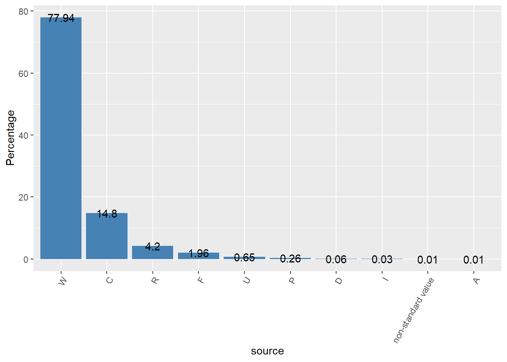
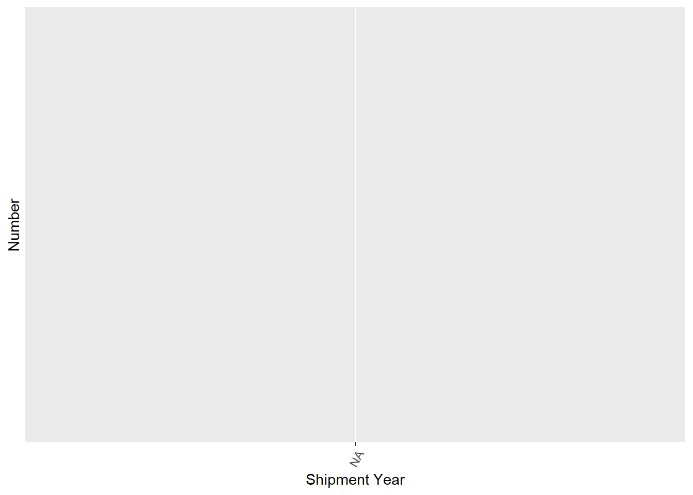
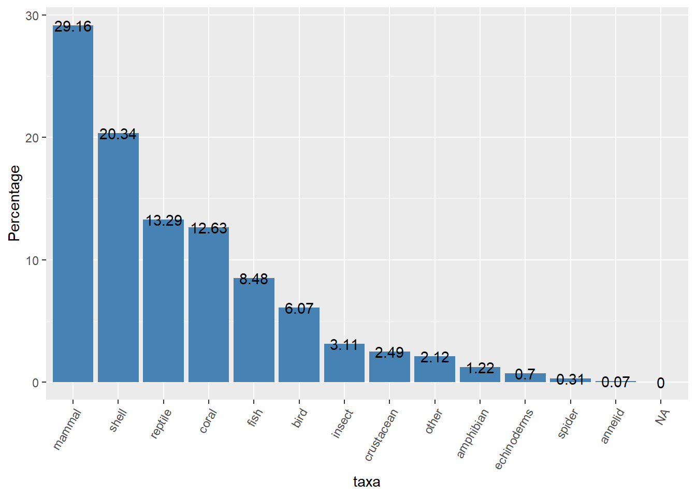

--- 
title: "Faunalytics - Wildlife trade dataset"
date: "`r Sys.Date()`"
description: ''
documentclass: book
link-citations: yes
site: bookdown::bookdown_site
biblio-style: apalike
---

# Introduction
**This report is intended to explore some ideas about LEMI dataset** accessed with the lemis R package. 
LEMIS wildlife trade data trends from 2000 through 2014. You can read more about this dataset [Here](https://www.nature.com/articles/s41597-020-0354-5)

## Summary
- **All the shipments are imports. Only a very small percentage of them was refused by the USFWS (1.73%)**

- **54% of dispositions took place within a month of the shipment date (most of them within a week)**

- **Most problematic countries are on both sides (country of origin & country to/from which the wildlife product is shipped)**

```{r echo=FALSE, out.width = '100%'}

```

**These are the American corporations that are importing the most.**
```{r echo=FALSE, out.width = '100%'}
knitr::include_graphics("./_bookdown_files/report_bookdown_files/figure-html/unnamed-chunk-16-2.png")
```

- **There has been an upward trend in the amount of dollars spent** from 2000 to 2012 (Although we don't have enough information about this variable in the data produced between 2008-2011 and 2013-2014. For more information, check the section 2.1.1.).

```{r echo=FALSE, out.width = '100%'}

```

- **Most of the products are "Live specimens" (29.1%), followed by trophies (16.83%) and "Shell products" (9.49%), mainly import by commercial purposes (74.6%).**

- **Most of the imports are mammals (29.16%), followed by shells (20.34%), reptiles (13.29%) and corals (12.63%)**
```{r echo=FALSE,  out.width = '100%'}

```


 


